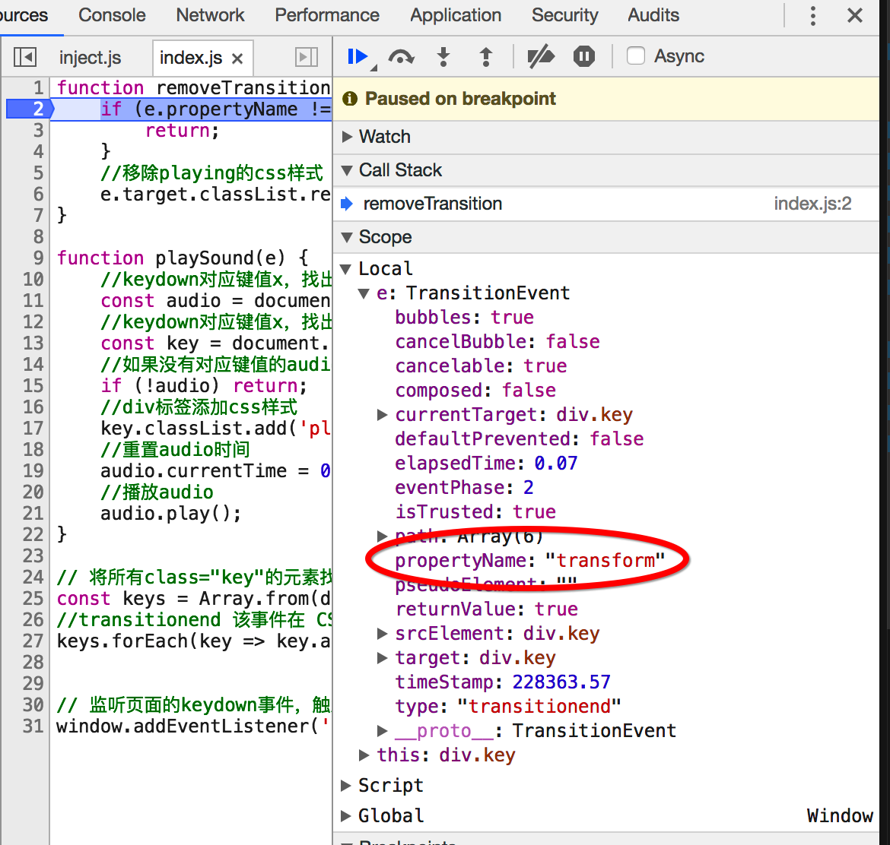

# JavaScript挑战30天 01
代码就不贴了，说下一些之前不懂或者不熟悉的点进行下梳理（毕竟前端只是自己粗略的自学过，还是一个小菜鸟）

### html部分
* 我们从最开始的```<!DOCTYPE html>  ```标签说起

	
	<!DOCTYPE> 声明必须是 **HTML 文档的第一行**，位于 ```<html>``` 标签之前。
	<!DOCTYPE> 声明不是 HTML 标签；它是指示 web 浏览器关于页面使用哪个 HTML 版本进行编写的指令。
	H5 之后，就都是<!DOCTYPE html>  这样写法了。之前的版本不再深究。
	
*  ```<link> ```标签
	
	定义文档与外部资源的关系。最常见的用途是链接样式表。

	```<link href="style.css" rel="stylesheet">``` href规定被链接文档的位置。rel规定当前文档与被链接文档之间的关系。

*  ```<script> ```标签

	```<script type="text/javascript" src="index.js">``` type指示脚本的 MIME 类型。scr规定外部脚本文件的 URL。
	
* ```data-*``` 

	HTML5中添加了data-*的方式来自定义属性，所谓data-*实际上上就是data-前缀加上自定义的属性名，使用这样的结构可以进行数据存放。使用data-*可以解决自定义属性混乱无管理的现状。
	
	```
	/*有2种方法设置data-* 属性*/
	/*1、在html标签中直接设置*/
	<div id="content" data-age="18">
	
	//2、在js中，用dataset设置 ；用这种方法也可以获取data-*属性；
	var content= document.getElementById('content');
	content.dataset.name = 'Jame';
	
	//本次的js里面，使用下面的方法，获取对应的data-*属性的元素
	const audio = document.querySelector(`audio[data-key="${e.keyCode}"]`);
	
	
	```
	
### CSS部分
* ```em``` 和```rem```这2个单位都是根据某元素的font-size来转换为px值的。

	```rem``` 根据html元素的font-size来转换。
	
	```em``` 根据使用em单位元素的font-size来转换。而元素继承其父元素的font-size，父元素又继承自己父元素的font-size，所以em会受到其任何父元素的font-size的影响。

*  background

	background 简写属性在一个声明中设置所有的背景属性。
	可以设置如下属性：
	* background-color
 	* background-position
	* background-size
 	* background-repeat
 	* background-origin
	* background-clip
	* background-attachment
	* background-image

* 	background-size
	*  length：设置背景图像的高度和宽度。第一个值设置宽度，第二个值设置高度。如果只设置一个值，则第二个值会被设置为 "auto"。
	*  percentage：以父元素的百分比来设置背景图像的宽度和高度。第一个值设置宽度，第二个值设置高度。如果只设置一个值，则第二个值会被设置为 "auto"。
	*  cover：把背景图像扩展至足够大，以使背景图像完全覆盖背景区域。背景图像的某些部分也许无法显示在背景定位区域中。
	*  contain：把图像图像扩展至最大尺寸，以使其宽度和高度完全适应内容区域。


*  display: flex  -- 弹性布局。布局后keys的子元素key们就平均分配keys的空间了。子元素的width元素，起到一个min-width的效果

*  min-height: 100vh

	1vw等于视口宽度（viewport width）的百分之一，也就是说100vw就是视口的宽度。同理，1vh等于视口高度（viewport height）的百分之一。


*  transition: all .07s ease
	* transition-property：规定设置过渡效果的 CSS 属性的名称。
		* none：没有属性会获得过渡效果。
		* all：所有属性都将获得过渡效果。
		* property：定义应用过渡效果的 CSS 属性名称列表，列表以逗号分隔。
	* transition-duration：规定完成过渡效果需要多少秒或毫秒。
	* transition-timing-function：规定速度效果的速度曲线。
		* linear：规定以相同速度开始至结束的过渡效果（等于 cubic-bezier(0,0,1,1)）。
		* ease：规定慢速开始，然后变快，然后慢速结束的过渡效果（cubic-bezier(0.25,0.1,0.25,1)）。
		* ease-in：规定以慢速开始的过渡效果（等于 cubic-bezier(0.42,0,1,1)）。
		* ease-out：规定以慢速结束的过渡效果（等于 cubic-bezier(0,0,0.58,1)）。
		* ease-in-out：规定以慢速开始和结束的过渡效果（等于 cubic-bezier(0.42,0,0.58,1)）。
		* cubic-bezier(n,n,n,n)：在 cubic-bezier 函数中定义自己的值。可能的值是 0 至 1 之间的数值。
	* transition-delay：定义过渡效果何时开始。


*  text-shadow: 0 0 .5rem black;

	text-shadow 属性向文本添加一个或多个阴影。该属性是逗号分隔的阴影列表，每个阴影有两个或三个长度值和一个可选的颜色值进行规定。省略的长度是 0。
	```text-shadow: h-shadow v-shadow blur color;```
	* h-shadow：必需。水平阴影的位置。允许负值。
	* v-shadow：必需。垂直阴影的位置。允许负值。
	* blur：可选。模糊的距离。
	* color：可选。阴影的颜色


*  box-shadow: 0 0 1rem #ffc600

	box-shadow 属性向框添加一个或多个阴影。
	```box-shadow: h-shadow v-shadow blur spread color inset;```
	
	* h-shadow：必需。水平阴影的位置。允许负值。
	* v-shadow：必需。垂直阴影的位置。允许负值。
	* blur：可选。模糊的距离。
	* color：可选。阴影的颜色
	* spread：可选。阴影的尺寸。
	* inset：可选。将外部阴影 (outset) 改为内部阴影。


*  transform: scale(1.1)  

	transform 属性向元素应用 2D 或 3D 转换。该属性允许我们对元素进行旋转、缩放、移动或倾斜。


*  text-shadow: 0 0 .5rem black; 文本设置阴影。
```text-shadow: h-shadow v-shadow blur color;```

	* h-shadow：必需。水平阴影的位置。允许负值。
	* v-shadow：必需。垂直阴影的位置。允许负值。
	* blur：可选。模糊的距离。
	* color：可选。阴影的颜色


*  text-transform: uppercase;
	
	 这个属性会改变元素中的字母大小写，而不论源文档中文本的大小写。如果值为 capitalize，则要对某些字母大写，但是并没有明确定义如何确定哪些字母要大写，这取决于用户代理如何识别出各个“词”。
	 * none：默认。定义带有小写字母和大写字母的标准的文本。
	 * capitalize：文本中的每个单词以大写字母开头。
	 * uppercase：定义仅有大写字母。
	 * lowercase：定义无大写字母，仅有小写字母。
	 * inherit：规定应该从父元素继承 text-transform 属性的值。

### JS部分
* ```window.addEventListener('keydown', playSound);```
	
	```addEventListener(event,function,capture/bubble); ```
	
	第一个参数是事件的类型 (如 "click" 或 "mousedown").
	
	第二个参数是事件触发后调用的函数。
	
	第三个参数是个布尔值用于描述事件是冒泡还是捕获。该参数是可选的。

	capture与bubble分别是W3C制定得两种时间模式,简单来说capture就是从document的开始读到最后一行, 再执行事件, 而bubble则是先寻找指定的位置再执行事件. 
capture/bubble的参数是布尔值, True表示用capture, False则是bubble

* ```const audio = document.querySelector(`audio[data-key="${e.keyCode}"]`);```

	querySelector() 方法返回文档中匹配指定 CSS 选择器的一个元素。
	上面的句子为获取文档中，包含data-key为e.keyCode的属性的一个audio元素。
	querySelector只返回一个元素，如果要返回多个，用下面的操作

* ```const keys = Array.from(document.querySelectorAll('.key'));```
	document.querySelectorAll() 是 HTML5中引入的新方法，返回文档中匹配的CSS选择器的所有元素节点列表。
	
	上面的代码中，返回class=“key”的所有元素节点。
	
* ```key.classList.add('playing');```

	 classList 属性返回元素的类名，作为 DOMTokenList 对象。
该属性用于在元素中添加，移除及切换 CSS 类。
classList 属性是只读的，但你可以使用 add() 和 remove() 方法修改它。

* ```
	if (e.propertyName !== 'transform') {
        return;
    }
	```
	
	这里e为transitionend 事件，propertyName有多个。包括border-right-color；border-bottom-color；border-top-color；transform；border-left-color；box-shadow。
	当为transform时，移除playing的css样式。



	


