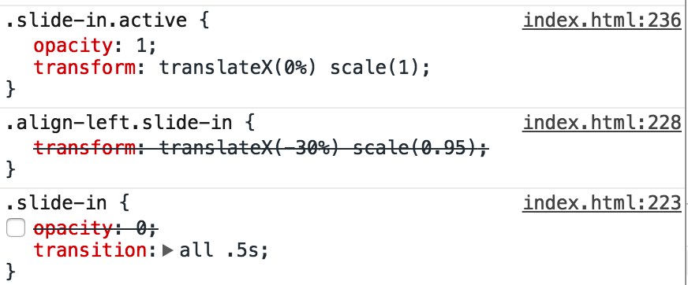

# JavaScript 30天挑战

## JS
### querySelector & querySelectorAll
querySelector 和 querySelectorAll 方法是 W3C Selectors API 规范中定义的。他们的作用是根据 CSS 选择器规范，便捷定位文档中指定元素。

querySelector() 返回一个对象

```Javascript
const audio = document.querySelector(`audio[data-key="${e.keyCode}"]`);
```

querySelectorAll() 返回的一个集合(NodeList)，它并非是 Array 类型的数据，所以并不具有 map 和 filter 这样的方法，所以如果要进行筛选操作则需要把它转化成 Array 类型，使用下面示例之中的 Array.from() 来转化

```Javascript
const keys = Array.from(document.querySelectorAll('.key'));
```

和addEventListener配合使用

```Javascript
const panels = document.querySelectorAll('.panel');
panels.forEach(panel => panel.addEventListener('click', toggleOpen));
```

### 将键盘输入和html元素联系起来

设置元素的dataset属性为对应按键的keyCode值，在按键触发时，querySelector获取对应元素的dataset属性为该值的元素，拿到对应的元素。再对元素进行操作。

```Javascript
<div data-key="76" class="key">
  <kbd>L</kbd>
  <span class="sound">tink</span>
</div>

<audio data-key="76" src="sounds/tink.wav"></audio>

<script>
	function playSound(e) {
	  const audio = document.querySelector(`audio[data-key="${e.keyCode}"]`);
	  const key = document.querySelector(`div[data-key="${e.keyCode}"]`);
	}

/**
 * 监听页面的keydown事件，触发playAudio函数。
*/
window.addEventListener('keydown', playSound);
</script>
```

### 修改css样式

方法一：使用Object.style.css属性

```Javascript
secondHand.style.transform = `rotate(${ secondDeg }deg) translateX(100px)`;

secHand.style.transition = 'all 0s';

p.style.color = '#BADA55';
p.style.fontSize = '50px';

text.style.textShadow = `
    ${xaisx}px ${yaisx * -1}px 2px rgba(0,255,0,0.7),
    ${xaisx * -1}px ${yaisx}px 2px rgba(255,0,0,0.7),
    ${yaisx}px ${xaisx * -1}px 2px rgba(188,188,188,0.7),
    ${yaisx * -1}px ${xaisx}px 2px rgba(0,0,255,0.7)      
    `;
```

方法二：使用Object.style.setProperty()

```Javascript
background.style.setProperty('width', `${coords.width}px`);
background.style.setProperty('height', `${coords.height}px`);
background.style.setProperty('transform', `translate3D(${coords.left}px,${coords.top}px,0)`);

//设置全局css变量
document.documentElement.style.setProperty(`--${this.name}`, this.value + suffix);

document.documentElement.style.setProperty('--base', '#fff');
```

另外，网上还找到其他3种修改css样式的方法

方法三：使用Object.style.cssText

```Javascript
var obj = document.getElementById("btnB");
obj.style.cssText = "background-color:black; display:block;color:White;

```

<!--下面2个感觉是改变一个类的样式-->

方法四：更改css类名className。下面2种方法的效果是一样的

```Javascript
obj.className = "style2";
obj.setAttribute("class", "style2");
```

方法五：使用更改外联的css文件，从而改变元素的css

```Javascript
<link href="css1.css" rel="stylesheet" type="text/css" id="css"/>
 
function changeStyle4() {
   var obj = document.getElementById("css");
   obj.setAttribute("href","css2.css");
 }
```

### classList.add && classList.remove

通常这2个方法都是配合使用，产生动画的效果

```Javascript
if (isHalfShown && isNotScrolledPast) {
	sliderimage.classList.add('active');
} else {
	sliderimage.classList.remove('active');
}
```

在第13天挑战里面，我发现active这个类ccs里面是这样写的（.aaa.bbb 指同时拥有aaa、bbb类）

```Javascript
	.slide-in {
       opacity: 0;
       transition: all .5s;
    }

    .test.align-left.slide-in {
        transform: translateX(-30%) scale(0.95);
    }

    .test.align-right.slide-in {
        transform: translateX(30%) scale(0.95);
    }

    .slide-in.active {
      transform: translateX(0%) scale(1);
       opacity: 1;
       
    }
```

当.slide-in.active 改为.active时，transform这个属性失效了。感觉是因为拥有2个类的优先级比较高，只有一个类的样式被覆盖了


### 捕捉鼠标拖拽

mousedown和mouseup发生时，修改flag，避免在鼠标抬起的时候也触发事件

```Javascript
let mouseflag = false;
ranges.forEach(item => item.addEventListener('click',handlePlayerSlider));
ranges.forEach(item => item.addEventListener('mousedown',() => mouseflag = true));
ranges.forEach(item => item.addEventListener('mouseup',() => mouseflag = false));
ranges.forEach(item => item.addEventListener('mousemove',(e) => mouseflag && handlePlayerSlider(e)));


let progressBarflag = false;
progress.addEventListener('click',handleprogressBar);
progress.addEventListener('mousemove',(e) => progressBarflag && handleprogressBar(e));
progress.addEventListener('mousedown',() => progressBarflag = true);
progress.addEventListener('mouseup',() => progressBarflag = false);
```

### event.preventDefault()

该方法将通知 Web 浏览器不要执行与事件关联的默认动作（如果存在这样的动作）。例如，如果 type 属性是 "submit"，在事件传播的任意阶段可以调用任意的事件句柄，通过调用该方法，可以阻止提交表单。注意，如果 Event 对象的 cancelable 属性是 fasle，那么就没有默认动作，或者不能阻止默认动作。无论哪种情况，调用该方法都没有作用。

### 将列表转化为HTML元素

通过map函数，将数组里面的数据作为属性，创建li元素并放进place的innerHTML中。place为ul元素。

```Javascript
function populateList(populates = [], place) { // 设置默认值，防止传参数出错的时候crash
      place.innerHTML = populates.map((populate, index) => {
        return `
          <li>
            <input type="checkbox" id=item${index} data-index=${index} ${populate.done ? 'checked' : ''}>
            <label for="item${index}">${(populate.text)}</label>
          </li>
        `; //之所以用‘’空字符是因为如果用null的话，会出现在html中
      }).join(''); // join()之后一定要加''，表示空字符，否则会加入逗号，造成错误  
    }
```

### LocalStorage

* `localStorage`的常用API：

	* `localStorage.setItem(‘key’,value); ->` 设置本地缓存，以`key-value`的形式
	* `localStorage.getItem(‘key’); ->` 根据参数key取得本地缓存中对应的值
	* `localStorage.clear();  ->` 清空本地的缓存
	* `localStorage.removeItem(‘key’); ->` 删除key所对应的那一条本地缓存

	
* `localStorage`中只能存储字符串，所以我们经常会用到： `JSON.stringify(object)`将一个对象转换为字符串，再使用`JSON.parse(objSting)`将一个对象字符串转换为对象

```
//存
localStorage.setItem('items', JSON.stringify(items));
//取
const items = JSON.parse(localStorage.getItem('items'))
```

### addEventListener

```
addEventListener(type, listener, {
    capture: false,
    passive: false,
    once: false
})
```
后面3个参数默认值都是false

capture：

（1）如果将useCapture设置为true，则侦听器只在捕获阶段处理事件，而不在目标或冒泡阶段处理事件。 

（2）如果useCapture为false，则侦听器只在目标或冒泡阶段处理事件。 

（3）当然，有的情况需要在所有三个阶段都侦听事件，此时不能使用|符号将true和false连接。为了实现针对三个阶段的事件响应，只能在代码中调用两次addEventListener()，第一次将useCapture设置为true，第二次再将useCapture设置为false。

once：表明该监听器是一次性的，执行一次后就被自动 removeEventListener 掉。
passive：Web开发者通过一个新的属性passive来告诉浏览器，当前页面内注册的事件监听器内部是否会调用preventDefault函数来阻止事件的默认行为，以便浏览器根据这个信息更好地做出决策来优化页面性能。当属性passive的值为true的时候，代表该监听器内部不会调用preventDefault函数来阻止默认滑动行为，Chrome浏览器称这类型的监听器为被动（passive）监听器。


